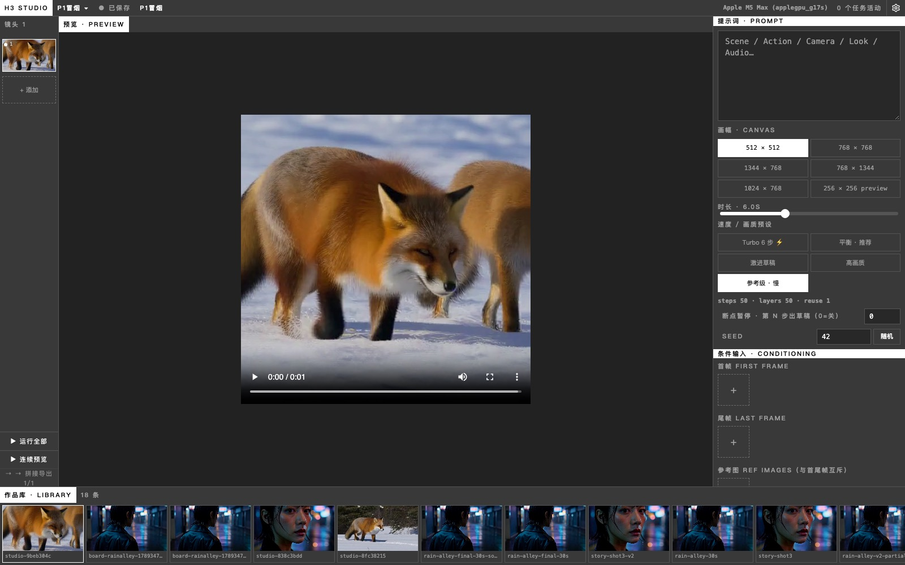
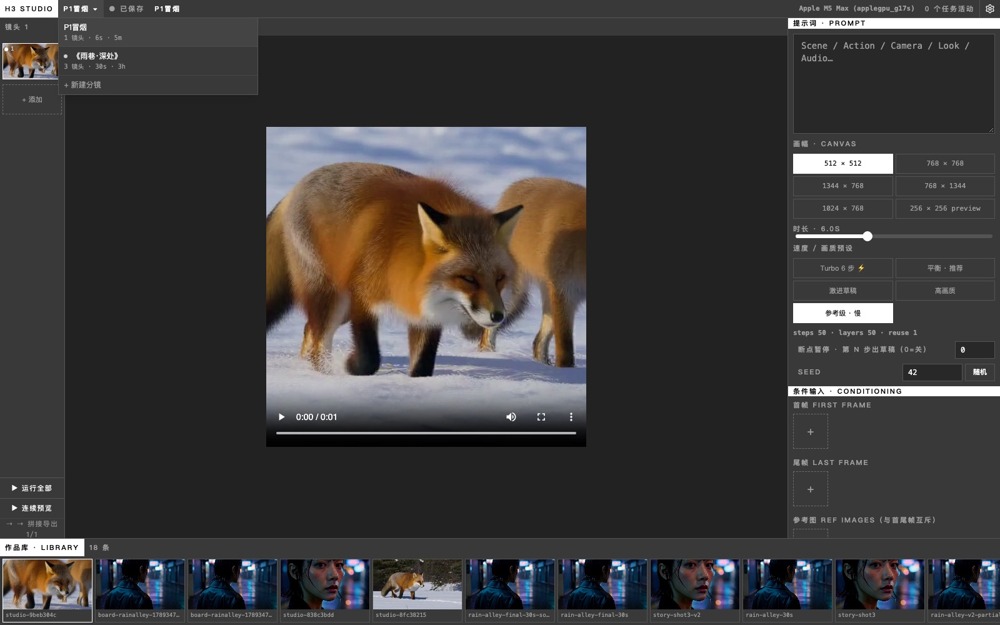

# h3.c-studio

[English](#english) | [中文](#中文)

[](LICENSE) [](studio/LICENSE)

---

## 中文

**H3 Studio — [antirez/h3.c](https://github.com/antirez/h3.c)（MiniMax-H3 Apple Silicon 原生推理引擎）的第二个图形界面。**

本仓库是 h3.c 的 fork，在原引擎基础上增加了 `studio/` Web 工作台：提示词工作室、条件输入管理（首帧/尾帧/参考图/参考音频）、实时生成进度、作品库与「末帧接力」分镜工作流，界面支持中/英/日/韩/德五语言。

> 引擎本体（根目录全部文件）仍为 antirez 的 MIT 项目，未做任何功能修改；我们只做加法。详见 [NOTICE](NOTICE)。

### 功能

<video src="https://github.com/skaiy/h3.c-studio/raw/main/docs/media/h3-studio-demo.mp4" controls muted width="800"></video>

| 统一工作台 · Unified Workspace | 分镜板切换 · Board Switcher |
|---|---|
|  |  |


- 🎛 **提示词工作室**：简易自由文本 / 结构化 Context-IR 双模式——结构化模式下 Scene / Action / Camera / Look / Audio 五个独立输入框，留空字段自动套用智能默认值再拼装成最终提示词；6 种画幅，1–15 秒时长，4 档速度/画质预设，seed 控制
- 🖼 **条件输入**：首帧 / 尾帧锚点、多张参考图（Ref2VA）、参考音频（音画同步条件输入），均支持拖拽上传
- 📈 **实时进度**：分阶段进度条（文本编码 → 去噪 → VAE 解码）+ 日志流，可取消任务
- 💾 **任务持久化**：任务状态落盘（`jobs.json`），重启进程后历史与进度不丢失，未完成的任务自动标记为「已中断」
- 🎞 **作品库**：自动索引生成历史，点播播放，支持删除（二次确认）
- 🔗 **末帧接力**：一键抽取任意视频末帧作为下一条的首帧，实现多镜头连贯叙事
- 🎬 **分镜板**：多镜头卡片序列 + 自动末帧接力链 + 一键无损拼接导出，多镜头叙事点几下就完成
- 🌐 **i18n**：中文 / English / 日本語 / 한국어 / Deutsch 一键切换

### 引擎增强（已吸收的上游社区 PR）

- **Turbo LoRA 折叠**（#14）：`tools/fold_turbo_lora.py` 将 5–6 步蒸馏采样直接烘焙进 checkpoint，提速 3–4 倍（Studio 内置「Turbo 6 步 ⚡」预设，一键切换折叠后的模型目录）
- **断点续跑**（#2）：`--checkpoint` / `--resume` 长视频中途暂停出草稿、随时续跑
- **进度与健壮性**：VAE 解码阶段进度上报（#35）、管道模式即时 flush（#62）、RGB 有限值保护（#9）、iPhone .mov 兼容（#31）

### 社区互鉴

同为 h3.c 图形界面的 [Henninges/h3-studio](https://github.com/Henninges/h3-studio)（专精音乐视频/唇形同步工作流）启发了本项目两个功能：结构化提示词的空字段智能默认值、以及参考音频条件输入（`--ref-audio`）。开源生态互相学习，感谢 Henninges 对本项目的关注、指正与热情交流；界面新增德语，也是对这份交流的一点致敬。

### 深度阅读

- [h3.c vs 其他视频生成框架：优劣势分析](docs/h3c-vs-other-stacks.md)——和 SGLang / ComfyUI / VDN / MLX-H3 怎么选
- [分镜持久化恢复](docs/persistence-recovery.md)——加载失败时阻止写入、保留原件与人工恢复步骤（#15，PR #17 已合并）
- [本地个人视频工作流路线图](docs/local-personal-workflow.md)——依赖、PR 拆分、数据契约与验收门槛；#7、#8 后端/前端均已合并；#14/#16/#17 已在 `main`（`1a1d35f`）；#9 前端 PR B 在本分支实现，待人工评审/合并；#10–#11 尚未交付
- [本地参考集：中英操作指南与 API](docs/reference-sets-api.md)——顶部管理入口（无镜头也可用）、本地导入、有序参考集、显式应用与冻结快照；#9 后端 PR A (#16) 已合并，本 PR 不改后端

### 快速开始

```bash
# 1. 构建引擎（需要 Apple Silicon Mac + FFmpeg）
make -j8

# 2. 下载模型权重到 ./MiniMax-H3（约 268GB，两套 checkpoint）
#    参考根目录 README.md 的说明

# 3. 启动 Studio
cd studio
npm install
uv venv server/.venv && uv pip install --python server/.venv/bin/python \
  fastapi "uvicorn[standard]" pydantic python-multipart
npm run dev        # 自动拉起 FastAPI 后端(:8765) + Vite 前端
```

打开 Vite 输出的地址（默认 http://localhost:3000）即可使用。

默认无需鉴权，适合本地单机使用。如果后端需要暴露在局域网/公网可达的地址上，设置 `H3_STUDIO_TOKEN` 环境变量后再启动，所有写操作（生成、删除、编辑分镜板等）将要求 `Authorization: Bearer <token>`；只读接口（预览、轮询）不受影响。前端在「设置 → 访问令牌」里填入同样的 token 即可继续使用。

**令牌仅保护写入，读取与媒体仍公开可访问。** 请保持本机使用，不要把它当作对外发布的完整访问控制；本地参考集不上传外部服务，也不保证身份或口型一致。

```bash
H3_STUDIO_TOKEN=your-secret-token npm run dev
```

### 更新履历

| 日期 | 更新内容 |
|---|---|
| 2026-09-13 | 首个版本发布：提示词工作室、条件输入（首尾帧/参考图）、实时进度、作品库、末帧接力 |
| 2026-09-13 | 新增分镜板：多镜头卡片、自动末帧接力、一键无损拼接导出 |
| 2026-09-14 | v0.2 统一工作台：五区信息架构、分镜板 CRUD + 拖拽排序、设置面板 + 中/英/日/韩四语言、连续预览、空状态引导 |
| 2026-09-14 | Turbo 6 步预设、断点续跑界面化、发布 h3.c 与其他推理栈对比分析文档、README 补充演示视频与截图 |
| 2026-09-14 | 后端加固：pytest 单测套件（#1）、任务持久化重启不丢失（#3）、可选 Bearer token 鉴权（#2） |
| 2026-09-14 | 吸收 [Henninges/h3-studio](https://github.com/Henninges/h3-studio) 优点：参考音频条件输入、结构化 Context-IR 提示词字段（空字段智能默认值），感谢 Henninges 的分享与热情交流；新增德语作为对他关注本项目的致敬，界面增至五语言 |
| 2026-09-15 | **本分支（in this branch）**：[P0 #7](https://github.com/skaiy/h3.c-studio/issues/7) 条件输入与结构化提示词持久化、单条/批量共用后端请求构建与预检、按原任务快照安全续跑、保存冲突提示与回归测试；合并状态见关联 PR |
| 2026-09-16 | [P1 #8](https://github.com/skaiy/h3.c-studio/issues/8) 后端 #13 已合并：不可变 take、旧 output 迁移、采用/删除 API、接力来源身份及 stale/missing 状态 |
| 2026-09-16 | **#8 前端 PR B (#14) 已合并**：版本历史与只读参数快照、预览/采用分离、下游连续性警告、缺失媒体提示与安全删除；覆盖五语言。预览不生成、不改输入；采用前保存草稿；仅删除版本记录不删除原视频 |
| 2026-09-16 | **`main`（`1a1d35f`）已包含 #14/#16/#17**：#9 后端 PR A (#16) 提供本地素材/参考集与冻结快照；#15 的启动恢复保护 (#17) 已合并 |
| 2026-09-16 | **#9 前端 PR B 本分支实现，待人工评审/合并**：项目参考集管理、本地图片/音频导入、有序编辑与镜头显式应用、旧修订/缺失素材提示及历史参考快照；覆盖五语言。保存不应用、不生成；失败保留草稿，不自动重放写入；本 PR 不改后端 |

### 协议

- 引擎（根目录）：MIT © antirez（见 [LICENSE](LICENSE)）
- Studio（`studio/`）：Apache-2.0 © skaiy（见 [studio/LICENSE](studio/LICENSE)）
- 模型权重不包含在本仓库中，受 MiniMax H3 Community License 约束（含地域限制），下载前请阅读模型卡

---

## English

**H3 Studio — the second GUI for [antirez/h3.c](https://github.com/antirez/h3.c), the native Apple Silicon inference engine for MiniMax-H3.**

This repository forks h3.c and adds a `studio/` web workbench: a prompt studio, conditioning management (first/last frame + reference images + reference audio), live generation progress, a clip library, and a "chain last frame" storyboard workflow. UI available in 5 languages (中文 / English / 日本語 / 한국어 / Deutsch).

> The engine itself (everything at repo root) remains antirez's MIT project, unmodified — we only add on top. See [NOTICE](NOTICE).

### Features

<video src="https://github.com/skaiy/h3.c-studio/raw/main/docs/media/h3-studio-demo.mp4" controls muted width="800"></video>

| Unified Workspace | Board Switcher |
|---|---|
|  |  |


- 🎛 **Prompt studio**: Simple free-text mode or structured Context-IR mode — five independent Scene / Action / Camera / Look / Audio fields, each falling back to a sensible default when left blank before being assembled into the final prompt; 6 canvas sizes, 1–15s duration, 4 speed/quality presets, seed control
- 🖼 **Conditioning**: first/last frame anchors, multiple Ref2VA reference images, and reference audio (for audio-driven sync) — all with drag upload
- 📈 **Live progress**: per-phase progress (text encode → denoise → VAE decode) with log stream and cancellable jobs
- 💾 **Job persistence**: job state is saved to disk (`jobs.json`), so history and progress survive a backend restart; unfinished jobs are auto-marked "interrupted"
- 🎞 **Clip library**: automatic history indexing, click-to-play, deletable (two-step confirm)
- 🔗 **Chain last frame**: extract any clip's last frame as the next generation's first frame for coherent multi-shot storytelling
- 🎬 **Storyboard**: multi-shot cards + automatic last-frame chaining + one-click lossless concat export
- 🌐 **i18n**: one-click switch between 中文 / English / 日本語 / 한국어 / Deutsch

### Engine enhancements (absorbed upstream community PRs)

- **Turbo LoRA folding** (#14): `tools/fold_turbo_lora.py` bakes 5–6 step distilled sampling into the checkpoint for a 3–4x speedup (Studio ships a one-click "Turbo 6-step ⚡" preset wired to the folded model dir)
- **Resumable checkpoints** (#2): `--checkpoint` / `--resume` pauses long renders with a sigma-zero draft and continues later
- **Progress & robustness**: VAE decode progress reporting (#35), immediate pipe flush (#62), finite-RGB guard (#9), iPhone .mov tolerance (#31)

### Cross-pollination

[Henninges/h3-studio](https://github.com/Henninges/h3-studio) — another web GUI for h3.c, specialized for the music-video / lip-sync workflow — inspired two features here: smart defaults for empty structured-prompt fields, and reference-audio conditioning (`--ref-audio`). Thanks to Henninges for the attention, the correction, and the friendly exchange; open-source GUIs for the same engine learning from each other is exactly how this should go. Adding German to the UI is a small tribute to that exchange.

### Further reading

- [h3.c vs other video generation stacks](docs/h3c-vs-other-stacks.md) — how to choose between h3.c, SGLang, ComfyUI, VDN and MLX-H3
- [Storyboard persistence recovery](docs/persistence-recovery.md) — write blocking, original-file preservation and manual recovery (#15, PR #17 merged)
- [Local personal video workflow roadmap](docs/local-personal-workflow.md) — dependencies, PR splits, data contracts and acceptance gates; #7 and both #8 PRs are merged; #14/#16/#17 are on `main` (`1a1d35f`); #9 frontend PR B is implemented in this branch, pending human review/merge; #10–#11 are not delivered
- [Local reference sets: Chinese/English UI guide and API](docs/reference-sets-api.md) — header management even without shots, local imports, ordered sets, explicit application and frozen snapshots; #9 backend PR A (#16) is merged and this PR leaves the backend unchanged

### Quick start

```bash
# 1. Build the engine (Apple Silicon Mac + FFmpeg required)
make -j8

# 2. Download the MiniMax-H3 weights into ./MiniMax-H3 (~268GB)
#    See the root README.md for details

# 3. Start the studio
cd studio
npm install
uv venv server/.venv && uv pip install --python server/.venv/bin/python \
  fastapi "uvicorn[standard]" pydantic python-multipart
npm run dev        # boots FastAPI backend (:8765) + Vite frontend
```

Open the Vite URL (default http://localhost:3000).

No auth is required by default, which is fine for local single-user use. If you expose the backend on a LAN- or internet-reachable address, set `H3_STUDIO_TOKEN` before starting it — every write operation (generate, delete, edit boards, etc.) will then require `Authorization: Bearer <token>`; read-only endpoints (preview, polling) are unaffected. Enter the same token under Settings → Access token in the UI.

**The token protects writes only; reads and media remain public.** Keep this workflow local; the token is not complete access control for external hosting. Local reference sets do not upload to external services or guarantee identity consistency or lip sync.

```bash
H3_STUDIO_TOKEN=your-secret-token npm run dev
```

### Changelog

| Date | Changes |
|---|---|
| 2026-09-13 | Initial release: prompt studio, conditioning (first/last frame + reference images), live progress, clip library, chain last frame |
| 2026-09-13 | Added Storyboard view: multi-shot cards, automatic last-frame chaining, one-click lossless concat export |
| 2026-09-14 | v0.2 unified workspace: five-zone IA, board switcher CRUD + drag-reorder, settings panel + 4-language i18n (zh/en/ja/ko), sequence preview, guided empty states |
| 2026-09-14 | Turbo 6-step preset, resumable checkpoints in the UI, published the "h3.c vs other stacks" comparison doc, added demo video + screenshots to README |
| 2026-09-14 | Backend hardening: pytest test suite (#1), job persistence across restarts (#3), optional Bearer-token auth (#2) |
| 2026-09-14 | Absorbed ideas from [Henninges/h3-studio](https://github.com/Henninges/h3-studio): reference-audio conditioning, structured Context-IR prompt fields with smart defaults — thanks to Henninges for sharing and the friendly exchange; added German as a tribute to his attention to this project, 5 languages total |
| 2026-09-15 | **In this branch**: [P0 #7](https://github.com/skaiy/h3.c-studio/issues/7) conditioning-input and structured-prompt persistence, consistent single/batch server request building and preflight, safe resume from the original job snapshot, save-conflict feedback and regression tests; see the linked PR for merge status |
| 2026-09-16 | [P1 #8](https://github.com/skaiy/h3.c-studio/issues/8) backend #13 merged: immutable takes, legacy-output migration, selection/deletion APIs, chain-source identity and stale/missing states |
| 2026-09-16 | **#8 frontend PR B (#14) merged**: take history and read-only snapshots, separate preview/adoption, downstream continuity warnings, missing-media feedback and safe deletion in five languages. Preview never generates or changes inputs; adoption flushes drafts first; deleting a take record retains its original video |
| 2026-09-16 | **`main` (`1a1d35f`) includes #14/#16/#17**: #9 backend PR A (#16) provides local assets/reference sets and frozen snapshots; #15 startup recovery protection (#17) is merged |
| 2026-09-16 | **#9 frontend PR B implemented in this branch, pending human review/merge**: project reference management, local image/audio imports, ordered editing and explicit shot application, old-revision/missing-media feedback and historical reference snapshots in five languages. Saving does not apply or generate; failures retain drafts without replaying writes; backend unchanged by this PR |

### Licensing

- Engine (repo root): MIT © antirez — see [LICENSE](LICENSE)
- Studio (`studio/`): Apache-2.0 © skaiy — see [studio/LICENSE](studio/LICENSE)
- Model weights are NOT included and are governed by the MiniMax H3 Community License (with territorial restrictions) — read the model card before downloading
